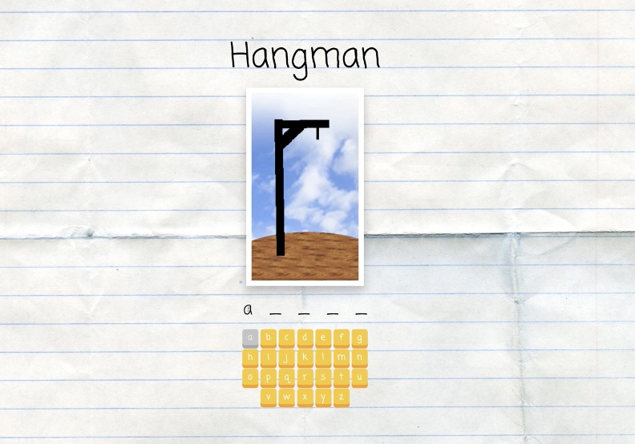
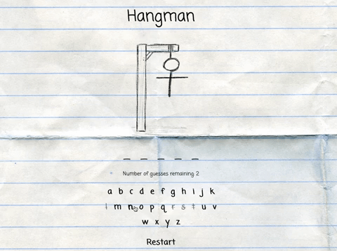

# React Hangman Game
A React hangman game exercise.

## The Goal

#### Part One: Add A Key

Currently, the buttons don’t have a key prop. Fix this issue!

#### Part Two: Number of Wrong Guesses

Above the currently-guessed word, we’d like to show the number of wrong guesses, like “Number wrong: 3.” Add this.

#### Part Three: End Game on Loss

The game only comes (by default) with 6 gallows images and therefore should only allow six wrong guesses. However, it allows players to keep making guesses after this (and there’s a bug, in that the gallows images disappears after there are too many wrong).

Change the behavior of the game so that after six wrong guesses, it no longer shows the button area. Instead, it should show the message “You lose” and reveal the correct word.

Do this without hard-coding “6” in as the number of guesses — instead, use the prop for maxGuesses.

#### Part Four: Alt Text

Add an alt attribute to the hangman image that explains how many guesses have been made, inc case the images don’t load. Something like “5/6” or “5 wrong guesses”

#### Part Five: Use a Random Word

The game right now always uses the word “apple” as the secret word. There’s a file, words.js, with a list of words and a function to return a random word. Incorporate this so that the game uses this to choose a secret word.

#### Part Six: Add “Restart” Button

Add a button that will restart the game. This should pick a new random word and reset the guessed list and number of wrong guesses.

#### Further Study

Imagine that other games use a sequence of buttons with letters on them. It would be nice if the buttons could be reusable components.

Refactor the app, adding an AlphaButtons component.

The AlphaButtons component renders a sequence of buttons corresponding to letters (in Hangman that would be “a” through “z”). The Hangman component should keep track of which letters have been guessed.

# Additional Ideas

Add a message if the player wins (guesses all the letters)
Add more CSS styling -- in which I changed the look and created my own images for the theme of this app.

Here is how the code base looks from the beginning:

## My Finished Project

[Click here](https://tyecampbell-hangman.netlify.com) to preview a live example. 

##### What I Learned

My biggest take away from this exercise was understanding how to render specific information based on conditions. First time using Set() and and so I had to learn how that works. 

:thumbsup: *Thanks for checking out my work on GitHub! For more about me find me on Twitter [@TyeDev](https://twitter.com/tyedev) or vist my personal website [TyeCampbell.com](www.TyeCampbell.com).*
